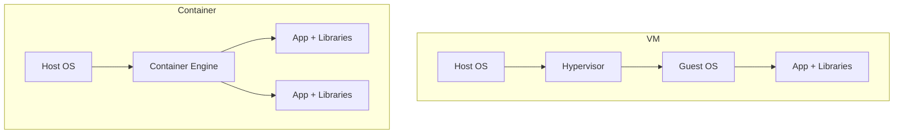
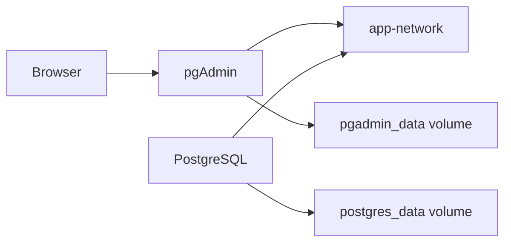

# Docker 基礎教材

この教材は、Docker コンテナの基本概念から `docker compose` を使った複数コンテナ構成までを、最短で手を動かしながら学ぶための入門資料です。

できるだけ専門用語をかみくだいて説明します。最初は全部を厳密に覚えなくても大丈夫です。「イメージからコンテナを起動する」「複数コンテナを Compose でまとめる」という流れがつかめれば十分です。

## 0. まず最初に覚えたい用語

Docker の話では似た言葉がたくさん出てきます。最初は次の 6 個だけ押さえるとかなり楽になります。

| 用語 | ひとことで言うと | たとえ |
| --- | --- | --- |
| `image` | コンテナの元になる実行テンプレート | 料理のレシピ |
| `container` | image から起動した実体 | 実際に作った料理 |
| `Dockerfile` | image の作り方を書くファイル | レシピを書く紙 |
| `registry` | image を置いておく場所 | ネット上の倉庫 |
| `volume` | 消したくないデータを残す場所 | 机の引き出し |
| `network` | コンテナ同士が通信する仕組み | 同じ社内 LAN |

この教材では、特に次の 2 つをよく区別します。

- `image`: まだ起動していない「元データ」
- `container`: 実際に動いている、または動いたことがある「実体」

## 1. コンテナとは

コンテナは、アプリケーションとその実行に必要なライブラリや設定をひとまとめにして動かす仕組みです。

少しかみくだいて言うと、アプリを「この環境なら動くはず」ではなく、「この環境ごと持ち運ぶ」に近づける仕組みです。

ポイントは次の 3 つです。

- アプリを実行環境ごとまとめて配布できる
- 開発者の PC、検証環境、本番環境で同じように動かしやすい
- ホスト OS のカーネルを共有するので、VM より軽量になりやすい

たとえば `nginx` コンテナなら、「Web サーバーとして動くための最小限の実行環境」がイメージから起動されます。

新人向けに言い換えると、コンテナは「このアプリを動かすための小さな専用部屋」です。必要なものを部屋の中にまとめておくので、手元でもサーバーでも同じ条件で動かしやすくなります。

## 2. VM との違い

VM とコンテナはどちらも「隔離された実行環境」を作りますが、仕組みが違います。



### VM

- 仮想ハードウェアの上で Guest OS ごと起動する
- 分離性は高いが、起動やリソース消費は比較的大きい
- OS ごと分けたいときに向く

### コンテナ

- ホスト OS のカーネルを共有する
- 起動が速く、軽量
- アプリ単位で環境をそろえたいときに向く

最初の理解としては、次のイメージで十分です。

- VM: パソコンの中に、もう 1 台パソコンを作る感じ
- コンテナ: 同じパソコンの中で、アプリごとに実行場所をきれいに分ける感じ

### ざっくり比較

| 観点 | VM | コンテナ |
| --- | --- | --- |
| 含まれるもの | OS ごと | アプリと依存関係 |
| 起動速度 | 比較的遅い | 速い |
| リソース消費 | 大きめ | 小さめ |
| 主な用途 | OS レベルの分離 | アプリ実行環境の統一 |

## 3. Docker とは

Docker は、コンテナを扱いやすくするためのツール群です。

「コンテナそのものの考え方」と「Docker というツール」は分けて考えると混乱しにくいです。

- コンテナ: アプリを隔離して動かす考え方、仕組み
- Docker: その仕組みを日常的に扱いやすくするツール

たとえば、手で全部設定する代わりに、Docker なら `docker run` や `docker compose up` のようなコマンドで操作できます。

Docker を使うと、主に次のことができます。

- イメージを取得する
- コンテナを起動、停止、削除する
- ログを見る
- `Dockerfile` から独自イメージを作る
- `docker compose` で複数コンテナをまとめて扱う

## 4. Docker Hub とは

Docker Hub は、Docker image を保存、共有、検索するためのサービスです。Docker Docs では、Docker Hub は image を保存する `registry` であり、Docker はデフォルトで Docker Hub を参照すると説明されています。

つまり、`docker run nginx` と書いたとき、ローカルに `nginx` image がなければ Docker Hub から取得しにいきます。

たとえると、Docker Hub は「コンテナ用のアプリストア」や「イメージ置き場」です。

### Docker Hub で何ができるか

- 公式の image を探す
- 他の人や会社が公開している image を取得する
- 自分で作った image をアップロードして共有する

### よくある利用例

#### 1. 既存 image を使う

```bash
docker pull nginx
docker run -d -p 8080:80 nginx
```

#### 2. 自分の image を公開する

```bash
docker login
docker build -t your-account/my-web:1.0 .
docker push your-account/my-web:1.0
```

### `nginx` とだけ書いて動くのはなぜか

`docker run nginx` の `nginx` は image 名です。Docker はまず自分の PC にその image があるかを見て、なければ Docker Hub から探して取得します。

### 初心者が知っておくとよい関連用語

- `Docker Hub`: Docker 社の代表的な公開 registry
- `registry`: image を保存する仕組み全般の名前
- `repository`: Docker Hub の中で image をまとめる単位
- `tag`: image の版や種類を区別する名前。例: `nginx:latest`, `postgres:16`

### どの image を使えばよいか

最初は次の方針で十分です。

- 学習用は `nginx`, `postgres` のようなよく使われる image を使う
- できれば Docker Official Images や信頼できる公開元を選ぶ
- `latest` に頼りすぎず、必要に応じて `postgres:16` のようにバージョンを明示する

## 5. GitHub Container Registry, Amazon ECR, Amazon ECS

Docker を学び始めると、次に出てきやすいのが「作った image をどこに置くか」と「その image を本番でどう動かすか」です。

ここでよく登場するのが次の 3 つです。

- `GitHub Container Registry (GHCR)`: GitHub 上で image を保管、共有する場所
- `Amazon ECR`: AWS 上で image を保管する場所
- `Amazon ECS`: AWS 上でコンテナを実行、管理する仕組み

一言で整理するとこうです。

- `GHCR` と `ECR` は「置き場」
- `ECS` は「実行と管理」

### GitHub Container Registry

GitHub Docs では、GitHub Container Registry は Docker と OCI image を保存、管理できる registry と説明されています。`ghcr.io` という名前空間で使われ、GitHub リポジトリと権限や公開設定を近い形で管理しやすいのが特徴です。

こんなチームに向いています。

- GitHub でソースコード管理をしている
- GitHub Actions で CI/CD を回している
- リポジトリごとに image の権限を管理したい

よくある流れ:

1. GitHub Actions でアプリをビルドする
2. Docker image を作る
3. `ghcr.io/組織名/アプリ名:タグ` に push する
4. 検証環境や本番環境で pull して動かす

### Amazon ECR

AWS Docs では、Amazon ECR はセキュアでスケーラブル、信頼性の高い AWS マネージドのコンテナ image registry と説明されています。

特徴:

- AWS IAM で権限管理しやすい
- image scanning で脆弱性検査ができる
- lifecycle policy で古い image の整理ができる
- ECS や EKS と連携しやすい

こんなイメージで考えるとわかりやすいです。

- GHCR: GitHub 中心の開発フローと相性がよい
- ECR: AWS 上の実行環境と相性がよい

### Amazon ECS

AWS Docs では、Amazon ECS はコンテナ化されたアプリケーションをデプロイ、管理、スケールしやすくするフルマネージドなコンテナオーケストレーションサービスと説明されています。

少しかみくだくと、ECS は「何台動かすか」「どこで動かすか」「落ちたらどうするか」をまとめて面倒見てくれる仕組みです。

たとえば本番環境では、次のような運用が必要になります。

- Web アプリを 3 台動かしたい
- 1 台落ちたら自動で立て直したい
- アクセスが増えたら台数を増やしたい
- 新版へ安全に入れ替えたい

ECS はそうした運用を支えるサービスです。

### ECR と ECS の関係

現場では次の流れが非常によくあります。

1. 開発者がコードを修正する
2. CI で image を build する
3. image を `ECR` に push する
4. `ECS` がその image を pull して本番へ反映する

つまり:

- `ECR`: コンテナ image の保管庫
- `ECS`: その image を実際に動かす実行基盤

### 実務でのよくある組み合わせ

- GitHub + GitHub Actions + GHCR
  GitHub 中心で完結しやすい、小中規模のチームや社内ツールでよく使われます
- GitHub + GitHub Actions + ECR + ECS
  AWS 本番運用まで含めた、かなり現場感のある構成です
- GitHub + CI + ECR + ECS + RDS
  Web アプリ、API、DB を分けて運用する典型的な業務システム構成です

## 6. Docker Desktop / Rancher Desktop のインストール

### Docker Desktop

初心者には Docker Desktop が最もわかりやすい選択です。Docker Engine、CLI、Compose がまとまって入ります。

#### macOS

1. [Docker Desktop for Mac の公式インストールページ](https://docs.docker.com/desktop/setup/install/mac-install/) を開く
2. Apple Silicon か Intel かに合ったインストーラをダウンロードする
3. `Docker.dmg` を開いて `Docker.app` を `Applications` にドラッグする
4. `Applications` から起動し、初回セットアップを進める

補足:

- Docker Docs では、macOS は「現在のメジャー版とその 2 つ前」までがサポート対象です
- 商用利用は会社規模によってライセンス条件が変わるので、必要に応じて公式条件を確認してください

#### Windows

1. [Docker Desktop for Windows の公式インストールページ](https://docs.docker.com/desktop/setup/install/windows-install/) を開く
2. WSL 2 を利用できる状態にする
3. Windows 用インストーラをダウンロードして実行する
4. 画面の案内に従ってセットアップする

補足:

- Docker Docs では、通常は `Per-user installation` が推奨されています
- Linux コンテナ用途なら WSL 2 バックエンドで十分です

### Rancher Desktop

Rancher Desktop は、ローカルでコンテナや Kubernetes を扱いたい人向けの代替ツールです。

Docker コマンドで学習したい場合は、初期設定で `dockerd (moby)` を選ぶと進めやすいです。`containerd` を使う場合は、普段の `docker` の代わりに `nerdctl` を使うことがあります。

#### macOS

1. [Rancher Desktop 公式インストールページ](https://docs.rancherdesktop.io/getting-started/installation/) を開く
2. GitHub Releases から `.dmg` をダウンロードする
3. アプリを `Applications` にドラッグする
4. 初回起動後、必要なセットアップを進める

補足:

- 公式 docs では macOS 13 以上が要件です
- 公式 docs では Homebrew ではなく GitHub 配布の DMG が推奨されています

#### Windows

1. [Rancher Desktop 公式インストールページ](https://docs.rancherdesktop.io/getting-started/installation/) を開く
2. 事前に WSL をインストールする
3. GitHub Releases から `.msi` をダウンロードして実行する
4. セットアップを完了する

補足:

- ローカルホスト以外に公開する機能では権限設定に注意が必要です

## 7. Hello World

まずは Docker が使えるか確認します。

```bash
docker run hello-world
```

流れは次のとおりです。

1. ローカルに `hello-world` image がなければ取得する
2. image からコンテナを起動する
3. テストメッセージを表示して終了する

ここで覚えておきたいのは、`docker run` は「なければ取得して、コンテナを作って、起動する」という便利コマンドだということです。

確認コマンド:

```bash
docker images
docker ps -a
```

補足:

- `docker images`: 手元にある image 一覧を見る
- `docker ps -a`: 起動中だけでなく終了済みコンテナも見る

## 8. nginx で Web 配信してみる

公式 `nginx` image を使うと、すぐに Web サーバーを起動できます。

```bash
docker run --name my-nginx -d -p 8080:80 nginx
```

意味:

- `--name my-nginx`: コンテナ名を付ける
- `-d`: バックグラウンド起動
- `-p 8080:80`: ホストの 8080 番をコンテナの 80 番へ転送
- `nginx`: 使う image 名

ブラウザで `http://localhost:8080` を開くと、nginx の初期ページが見えます。

ここで `-p 8080:80` が少し重要です。

- 左側の `8080`: 自分の PC からアクセスするポート
- 右側の `80`: コンテナの中で nginx が待ち受けているポート

つまり「自分の PC の 8080 に来た通信を、コンテナの 80 に流す」という意味です。

停止と削除:

```bash
docker stop my-nginx
docker rm my-nginx
```

## 9. `docker ps`

起動中のコンテナを見る基本コマンドです。

```bash
docker ps
```

終了済みも含めて見たい場合:

```bash
docker ps -a
```

見どころ:

- `CONTAINER ID`
- `IMAGE`
- `STATUS`
- `PORTS`
- `NAMES`

新人向けには、まず `IMAGE`, `STATUS`, `PORTS`, `NAMES` の 4 列だけ読めれば十分です。

## 10. `docker logs`

コンテナ標準出力・標準エラー出力を確認します。

```bash
docker logs my-nginx
```

追いかけながら見る:

```bash
docker logs -f my-nginx
```

トラブルシュートの最初の一歩として非常に重要です。

たとえば「コンテナがすぐ落ちる」「Web が表示されない」というとき、最初に見るべきものの 1 つがログです。

## 11. Dockerfile で Web コンテンツを追加する

単に `nginx` を起動するだけでなく、自分の HTML を配信したいときは `Dockerfile` を使います。

`Dockerfile` は「この image をどう作るか」を順番に書く設計書です。

```dockerfile
FROM nginx:alpine
COPY index.html /usr/share/nginx/html/index.html
```

この例では:

- `FROM nginx:alpine` で軽量な nginx image を土台にする
- `COPY` で自分の HTML をコンテナ内の公開ディレクトリへ配置する

ビルドと実行:

```bash
docker build -t my-nginx-site .
docker run --name my-site -d -p 8080:80 my-nginx-site
```

このリポジトリの実例:

- [nginx サンプル](../examples/nginx/README.md)

ここも初心者向けに言い換えると、`Dockerfile` は「既製品のコンテナを少し自分向けに作り変えるための手順書」です。

## 12. `docker compose`

複数コンテナをまとめて扱うための仕組みです。

たとえば、Web アプリと DB を毎回別々に起動するのは面倒です。`compose.yaml` に定義すると、一発で起動できます。

```yaml
services:
  web:
    build: .
    ports:
      - "8080:80"
```

基本コマンド:

```bash
docker compose up -d
docker compose down
docker compose ps
docker compose logs -f
```

`docker compose` のよい点:

- 複数サービスをまとめて管理できる
- ネットワークやボリュームも一緒に定義できる
- チームで同じ構成を再現しやすい

用語補足:

- `service`: Compose の中で定義するコンテナの役割単位
- `compose.yaml`: サービス構成を書く設定ファイル

たとえば `web` と `db` を別サービスとして書くと、「どの image を使うか」「どのポートを開けるか」「どのネットワークにつなぐか」を 1 ファイルで管理できます。

## 13. Jupyter をコンテナで立てる

Jupyter は、ブラウザ上で Python などを対話的に実行できるツールです。データ分析、機械学習の試作、SQL や可視化の検証、社内向けの分析メモ共有などでよく使われます。

コンテナで Jupyter を立てると、次のメリットがあります。

- Python やライブラリの環境差分を減らしやすい
- チームで同じ分析環境を再現しやすい
- ローカル PC を汚しにくい
- 検証用の環境をすぐ作って消せる

Jupyter Docker Stacks の公式 docs では、Jupyter 用の ready-to-run image が提供されており、現在は Quay.io から配布されています。

最小例:

```bash
docker run -p 8888:8888 quay.io/jupyter/base-notebook
```

このリポジトリでは、`docker compose` で起動できるサンプルを用意しています。

- [Jupyter サンプル](../examples/jupyter/README.md)

この例では次を学べます。

- ブラウザアプリをコンテナで起動する
- ホストのフォルダをコンテナへマウントする
- `compose.yaml` で設定を固定化する

### Jupyter をコンテナ化する実務イメージ

現場では次のような用途があります。

- データ分析チームの共通作業環境
- 機械学習の前処理や検証環境
- API をたたく検証ノートブック
- 社内レポートや PoC のたたき台

「開発環境が人によって違う」問題を減らしたいときに、コンテナ化された Jupyter はかなり役立ちます。

## 14. PostgreSQL + pgAdmin

次の段階として、DB と管理 UI を Compose で一緒に立ち上げます。

構成イメージ:



このリポジトリの実例:

- [PostgreSQL + pgAdmin サンプル](../examples/postgres-pgadmin/README.md)

### PostgreSQL と pgAdmin は何者か

- `PostgreSQL`: データを保存するデータベース本体
- `pgAdmin`: PostgreSQL をブラウザから操作しやすくする管理ツール

つまり、このハンズオンでは「データベース本体」と「その管理画面」を別コンテナとして動かします。

## 15. 初期 DB 構築、ネットワーク、ボリューム

### 初期 DB 構築

PostgreSQL 公式 image では、初回起動時に `/docker-entrypoint-initdb.d` 配下の `.sql` や `.sh` を自動実行できます。

典型例:

- テーブル作成
- 初期データ投入
- 開発用ユーザー作成

### ネットワーク

Compose では通常、同じ Compose プロジェクト内のサービスは同じネットワークに参加します。

そのため `pgadmin` から `postgres` へは、IP ではなくサービス名で接続できます。

例:

- ホスト名: `postgres`
- ポート: `5432`

### ボリューム

コンテナを削除しても DB データを残したい場合に使います。

例:

- `postgres_data`: PostgreSQL のデータ保存
- `pgadmin_data`: pgAdmin の設定保存

削除して作り直してもデータを残したいものは volume、手元のファイルをそのまま見せたいものは bind mount、という理解で始めるとわかりやすいです。

初心者向けには次の理解で十分です。

- `volume`: Docker が管理する永続データ置き場
- `bind mount`: 自分の PC のフォルダをそのままコンテナに見せる方法

今回の PostgreSQL 例では、初期 SQL を渡すために `bind mount` を使い、DB の保存には `volume` を使っています。

## 16. この教材で学べる最小コマンドセット

```bash
docker run hello-world
docker run --name my-nginx -d -p 8080:80 nginx
docker ps
docker logs my-nginx
docker build -t my-nginx-site .
docker compose up -d
docker compose ps
docker compose logs -f
docker compose down
```

## 17. つまずきやすいポイント

- `image` と `container` を混同しやすいです。消したい対象がどちらかを意識すると整理しやすくなります
- `localhost` とコンテナ名の使い分けで迷いやすいです。自分の PC からは `localhost`、コンテナ同士ではサービス名を使うことが多いです
- DB データやノートブックが消えたら、volume や bind mount を使っているかを確認します
- `docker compose down -v` は volume も消すので、学習中でも実データを消したくないときは注意します

## 18. 実際のシステム開発、ビジネスの現場でどう使われているか

ここからは、教材の範囲を少し超えて「実務では何に使われるのか」を見ます。

### まず結論

コンテナは、次のような現場で特によく使われます。

- Web アプリや API の本番運用
- マイクロサービス化されたシステム
- CI/CD でのビルド、テスト、自動デプロイ
- バッチ処理や非同期ジョブの実行
- 開発環境の標準化
- 分析基盤や Jupyter の共通実行環境

### パターン 1. Web アプリと API を同じ作法で動かす

たとえば業務システムでは、次のような構成がよくあります。

- フロントエンド
- API サーバー
- バックグラウンドジョブ
- DB

これらをそれぞれコンテナ化しておくと、環境差分が減り、チーム開発やデプロイがしやすくなります。

これはソースからの直接引用ではなく、ここまでの registry と orchestration の役割、および AWS のマイクロサービス/コンテナ運用資料から整理した一般的な実務パターンです。

### パターン 2. マイクロサービスを独立してデプロイする

AWS Architecture Blog では、マイクロサービスは小さな独立したサービス群として構成され、独立デプロイや変化への追従をしやすくすると説明されています。また AWS Compute Blog では、コンテナはマイクロサービスと自然に相性がよいと説明されています。

現場での意味:

- 注文機能だけ先に更新する
- 認証機能だけ別チームが運用する
- 負荷が高いサービスだけスケールさせる

1 つの巨大なアプリを丸ごと差し替えるより、小さな単位で変更しやすくなるのが利点です。

### パターン 3. CI/CD の中で image を成果物として扱う

現場では、アプリの zip ファイルや手作業デプロイの代わりに、「テスト済みの image そのもの」を成果物として扱うことが多いです。

よくある流れ:

1. GitHub に push する
2. CI で test と build を実行する
3. image を GHCR や ECR に push する
4. 本番環境はその image を pull してデプロイする

この形にすると、「開発でテストしたもの」と「本番で動かすもの」のずれが小さくなります。

### パターン 4. バッチ処理や一時ジョブにも使う

コンテナは常時動く Web アプリだけでなく、定期バッチやデータ変換処理にも向いています。

たとえば:

- CSV 取込ジョブ
- 集計バッチ
- メール送信ワーカー
- 画像変換処理

必要なときだけ起動して、終わったら止める、という使い方がしやすいからです。

### パターン 5. 分析や PoC の実行環境をそろえる

Jupyter のような対話型ツールも、コンテナと相性がよいです。

たとえば:

- 分析メンバー全員が同じ Python パッケージ構成を使う
- pandas や matplotlib の版差分で悩みにくくする
- 検証用の notebook をそのまま共有する

アプリ開発だけでなく、データ活用の現場でもコンテナはよく使われます。

### 具体的な事例 1. Smartsheet

AWS の事例では、Smartsheet は Amazon ECS と AWS Fargate を使って、デプロイ頻度を週次から 1 日に複数回へ改善し、デプロイにかかるエンジニア作業を数時間から数分へ短縮したと紹介されています。

この事例から読み取れること:

- コンテナは単に「動く」だけでなく、リリース速度の改善に効く
- デプロイ作業の標準化、自動化に向いている
- エンジニアの運用負荷を下げやすい

### 具体的な事例 2. Siimpl

Docker の事例では、Siimpl は Docker Build Cloud、GitHub Actions、Amazon ECS などを組み合わせ、ビルド時間を 90% 短縮し、ロールバックを容易にし、99.99% uptime の目標達成を支えたと紹介されています。さらに sidecar container と OpenTelemetry collector を使い、検知や復旧の時間短縮にもつなげています。

この事例から読み取れること:

- コンテナはアプリ実行だけでなく、CI/CD の高速化にも効く
- image のタグ運用は安全なロールバックに役立つ
- sidecar container で監視やログ収集などの周辺機能を分離しやすい

### 具体的な事例 3. .NET アプリのコンテナ化

AWS Compute Blog では、既存の ASP.NET Core アプリをコンテナ化して Amazon ECS と AWS Fargate 上でマイクロサービスとして運用する例が紹介されています。

この例が示す実務ポイント:

- 新規開発だけでなく既存アプリの移行にもコンテナは使える
- Java、.NET、Python、Node.js、Go など言語をまたいで同じ運用モデルに乗せやすい
- インフラ管理よりアプリ開発に集中しやすくなる

### ビジネス面で見たコンテナの価値

技術面だけでなく、ビジネス面では次の価値が大きいです。

- リリースを速くしやすい
- 障害時の切り戻しをしやすい
- チーム間で環境差分を減らしやすい
- 開発環境から本番まで同じ artifact を使いやすい
- 新機能の検証や小さな改善を回しやすい

### ただし注意点

コンテナを使えば自動的に設計がよくなるわけではありません。

- サービス分割しすぎると複雑になります
- 監視、ログ、権限、脆弱性対策は別途しっかり考える必要があります
- コンテナ化とマイクロサービス化は別の話です

## 19. 次にやるとよいこと

1. `examples/nginx` の `index.html` を書き換えて再ビルドする
2. `examples/jupyter` を起動して notebook を 1 つ追加してみる
3. `examples/postgres-pgadmin` の SQL を変えて初期データを増やす
4. `docker exec -it` でコンテナの中に入ってみる
5. `docker volume ls` と `docker network ls` で周辺リソースも観察する

## 20. 参考リンク

- [Docker Desktop for Mac 公式インストール手順](https://docs.docker.com/desktop/setup/install/mac-install/)
- [Docker Desktop for Windows 公式インストール手順](https://docs.docker.com/desktop/setup/install/windows-install/)
- [Docker Compose インストール概要](https://docs.docker.com/compose/install/)
- [Docker Hub 公式ドキュメント](https://docs.docker.com/docker-hub/)
- [What is Docker? 公式概要](https://docs.docker.com/engine/docker-overview/)
- [Jupyter Docker Stacks 公式ドキュメント](https://jupyter-docker-stacks.readthedocs.io/)
- [GitHub Container Registry 公式ドキュメント](https://docs.github.com/en/packages/working-with-a-github-packages-registry/working-with-the-container-registry)
- [Amazon ECR 公式概要](https://docs.aws.amazon.com/AmazonECR/latest/userguide/what-is-ecr.html)
- [Amazon ECS 公式ドキュメント](https://docs.aws.amazon.com/ecs/)
- [Smartsheet の Amazon ECS / Fargate 事例](https://aws.amazon.com/solutions/case-studies/smartsheet-ecs-fargate-case-study)
- [Siimpl の Docker 活用事例](https://www.docker.com/customer-stories/siimpl/)
- [AWS のマイクロサービスとコンテナ設計の解説](https://aws.amazon.com/blogs/architecture/lets-architect-architecting-microservices-with-containers/)
- [ASP.NET Core アプリを ECS / Fargate で動かす例](https://aws.amazon.com/blogs/compute/hosting-asp-net-core-applications-in-amazon-ecs-using-aws-fargate/)
- [Rancher Desktop 公式インストール手順](https://docs.rancherdesktop.io/getting-started/installation/)
